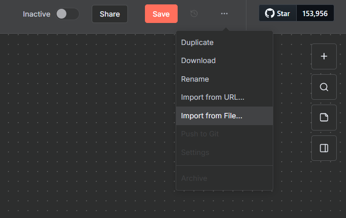
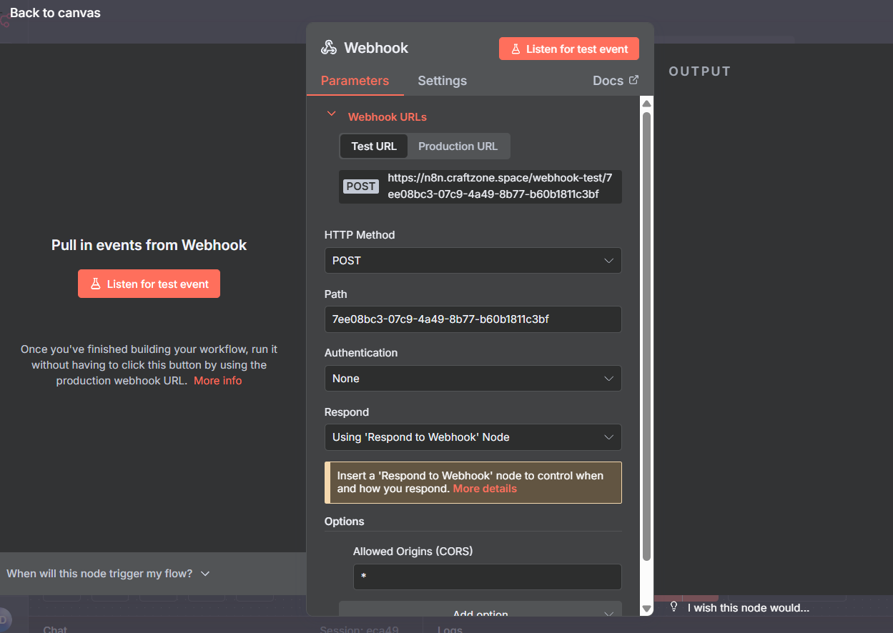
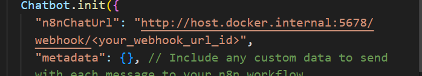

# 🤖 AI Chatbot — n8n + Crawl4AI + Whisper + Kokoro + MongoDB Atlas

A complete **AI Chatbot workflow automation stack** powered by Docker Compose. 

This setup combines workflow automation, web crawling, transcription, and text-to-speech into one cohesive environment.

---

## 🧩 Overview

| Service | Description | Port |
|----------|--------------|------|
| **n8n** | Workflow automation platform | `5678` |
| **MongoDB** | Persistent database backend for n8n | `27017` |
| **Crawl4AI** | Intelligent AI web crawling and extraction API | `11235` |
| **Kokoro (FastAPI)** | Text-to-speech (TTS) API service | `8880` |
| **Whisper ASR Webservice** | Speech-to-text (STT) service powered by OpenAI Whisper | `9000` |

All containers communicate via the shared internal `backend` network.

---

## ⚙️ Requirements

Before starting, ensure you have:

- [Docker](https://docs.docker.com/get-docker/)
- [Docker Compose](https://docs.docker.com/compose/install/) 
- A valid `.env` file with configuration values (see below)

---

## 🧾 Environment Variables

Replace your environment variable in `.env` file in the project root:

```bash
# General
DOMAIN=your_domain_name
SUBDOMAIN=your_subdomain
GENERIC_TIMEZONE=Europe/London

# Database
MONGO_USER=root
MONGO_PASSWORD=root

# Data paths
DATA_FOLDER=/path/to/data
```

## 💾 Persistent Volumes

| Volume          | Purpose                                 | External |
| --------------- | --------------------------------------- | -------- |
| `n8n_data`      | Stores n8n workflows and configurations | ✅        |
| `n8n_db`        | Stores Mongodb data files               | ✅        |
| `cache-whisper` | Caches Whisper ASR model files          | ✅        |
| `configdb`      | Caches Whisper ASR model files          | ✅        |
| `mongot`        | Caches Whisper ASR model files          | ✅        |

To create the volumes manually (if not yet created):

```bash
docker volume create n8n_data
docker volume create n8n_db
docker volume create cache-whisper
docker volume create configdb
docker volume create mongot
```

## 🚀 Usage

### 1️⃣ Start the Stack

### Local Development

```bash
docker compose -f docker-compose.yaml -f docker-compose.local.yaml up -d
```

### Production

```bash
docker compose up -d
```

### 2️⃣ Access Services

| Service             | URL                                              |
| ------------------- | ------------------------------------------------ |
| **n8n UI**          | [http://localhost:5678](http://localhost:5678)   |
| **Crawl4AI API**    | [http://localhost:11235](http://localhost:11235) |
| **Kokoro API**      | [http://localhost:8880](http://localhost:8880)   |
| **Whisper ASR API** | [http://localhost:9000](http://localhost:9000)   |

#### 🧾 MongoDB Setup

```bash
docker exec -it mongodb bash
```

```bash
mongosh "mongodb://root:<password>@<MONGODB_IP_ADDRESS>:27017"
```

1. Create database 

    ```bash
    use chatbot
    ```

2. Create collections 

    ```bash
    use n8n_chat_histories
    ```

    ```bash
    use website_knowledge_base
    ```

    ```bash
    use documents_knowledge_base
    ```

3. Create the vector search index

    ```bash
    db.runCommand({
        createSearchIndexes: "website_knowledge_base",
        indexes: [
            {
            name: "web_data_index",
            type: "vectorSearch",
            definition: {
                fields: [
                {
                    type: "vector",
                    path: "embedding",
                    numDimensions: 768,
                    similarity: "cosine"
                }
                ]
            }
            }
        ]
    });
    ```

    ```bash
    db.runCommand({
        createSearchIndexes: "documents_knowledge_base",
        indexes: [
            {
            name: "document_data_index",
            type: "vectorSearch",
            definition: {
                fields: [
                {
                    type: "vector",
                    path: "embedding",
                    numDimensions: 768,
                    similarity: "cosine"
                }
                ]
            }
            }
        ]
    });
    ```

    🧠 Adjust "dimensions" to match your embedding model:

        Gemini text-embedding-004 → **768** 
        OpenAI text-embedding-3-small → **1536**
        OpenAI text-embedding-3-large → **3072**

4. View vector search index.

    ```bash
    db.website_knowledge_base.aggregate([{ $listSearchIndexes: {} }])
    db.documents_knowledge_base.aggregate([{ $listSearchIndexes: {} }])
    ```


#### 🧾 Create and Upload your workflow in n8n UI

Upload the `chat-bot.json` file from the directory to the n8n.



### 3️⃣ Test the bot

1. Get the webhook url from the n8n workflow UI
2. 
    

3. replace the webhook url in `index.html` under `n8nChatUrl`.
   
   

Open `index.html` and chat with the bot.


